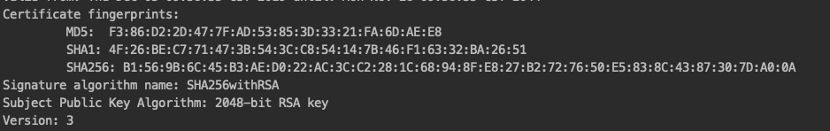
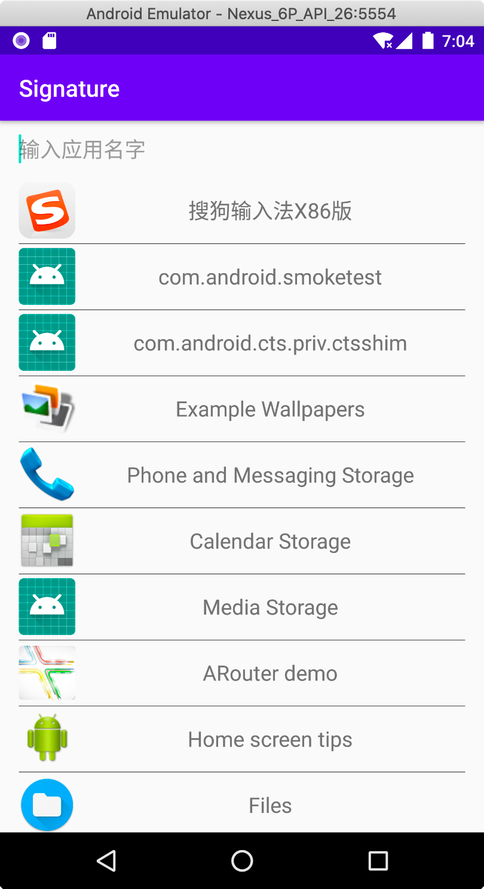
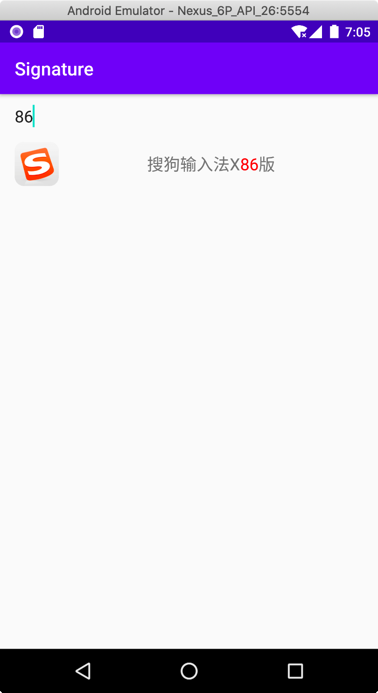
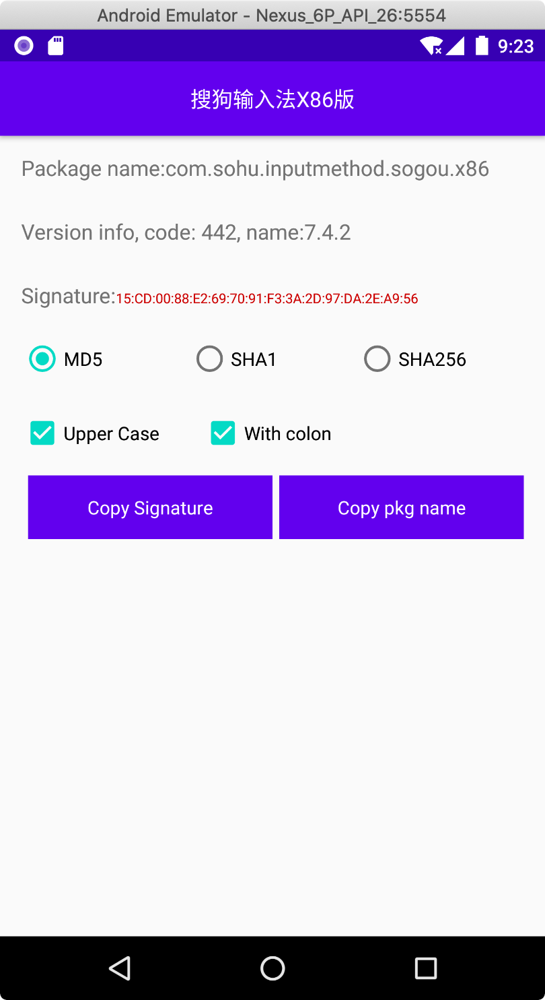

# Signature tool

### Why do I open this project

Recently I filled in the signature information on the [Wechat Open Platform](https://open.weixin.qq.com/).<br/>
I can not get the signature of my App in a simple way which makes me sad.

On the `Open Platform`, you will be  asked to fill in the application signature,<br/>
in order to get the signature first, the usual way is through `keytool`.
```
keytool -list -v -keystore ~/project/xxx/release.jks
```
But the results obtained cannot be used directly
<div align="center">

</div>

You need remove the ':' to get the string like  `F386D22D477FAD53853D3321FA6DAEE8`.

<p/>

Many people like me want a simple tool, it only needs an edit box, enter the application name(not the package name)<br/>
and get the signature information, then give me a button to copy that.

But the WeChat team did not mean to provide this tool

### How does the tool work

read all Apps on your phone first
you can filter the special application by type the keyword on the top of app list.

<div align="center">
    
    
    
</div>

## License

Copyright 2020 tanliner

Licensed under the Apache License, Version 2.0 (the "License");
you may not use this file except in compliance with the License.
You may obtain a copy of the License at

   http://www.apache.org/licenses/LICENSE-2.0

Unless required by applicable law or agreed to in writing, software
distributed under the License is distributed on an "AS IS" BASIS,
WITHOUT WARRANTIES OR CONDITIONS OF ANY KIND, either express or implied.
See the License for the specific language governing permissions and
limitations under the License.
